# PHASE 3: Continuous Machine Learning (CML) & Deployment

## 1. Continuous Integration & Testing
- [ ] **1.1 Unit Testing with pytest**
  - [ ] Test scripts for data processing, model training, and evaluation
  - [ ] Documentation of the testing process and example test cases
- [ ] **1.2 GitHub Actions Workflows**
  - We have created actions in the github project and also added the workflow yaml files to the project directiory, which can be found in `./github/workflows`. There are a total of three actions and yaml files. We have the `ruff.yml` which contains the information for running ruff, `docker-image.yml` for docker, and `cml.yml` for model-training. As for the project actions, you where you can find `Ruff`, `model-training`, and `Docker Image Continuous integration`. We setup the `Ruff` workflow to run on each push.
  
- [ ] **1.3 Pre-commit Hooks**
  - As for the pre-commit hooks we decided to focus on adding `mypy` and `ruff`. For adding pre-commit hooks you need to first install the `pre-commit` framework using `pip install pre-commit`. From then on we can create a yaml file to store our precommit requirements. We created `.pre-commit-config.yaml`, in here we put in the logic for checks that run with each step. We want to note that the reason we have SKIPPED is because in this commit we were not adding any NEW files that would require ruff or mypy formatting.
  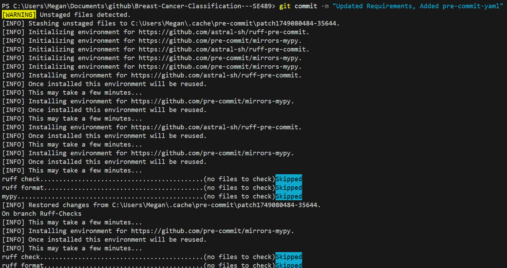 

  

## 2. Continuous Docker Building & CML
- **2.1 Docker Image Automation**
  - Docker builds have been automated. build images are pushed to dockerhub successfully. You can see an example here:

  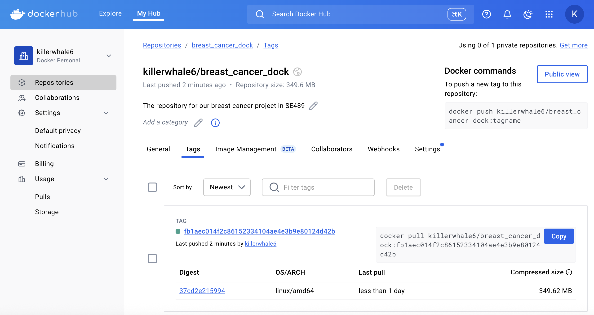

  - Docker builds are pushed to dockerhub automatically through a github action managed in a workflow file. The work flow files can be found in .github/workflows/docker-image.yml. In section 3.1 we will dive into GCP. The steps to make this build are simply to perform git push when you have this repository directed to a remote repository. This action is engaged with every push.
- **2.2 Continuous Machine Learning (CML)**
  - We have CML integreations on Pull requests in our remote repository. When ever a pull request is made and changes are pushed to the main branch, comments should appear in line with pull request comments. We did not enable any other checks as we want to be able to push anyways in our case. Please see below for a successful test of this functionality. (this was using a seperate repository for access issues, but has been installed in the current team repo as well)

 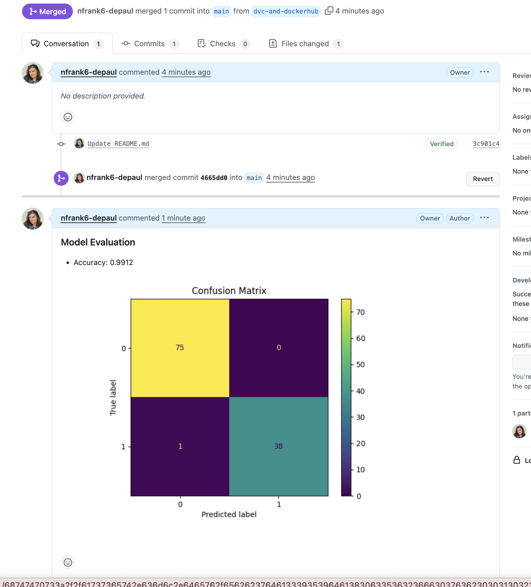

  - In order to set this functionality up we had to create a cml.yml file in .github/workflows/cml.yml. There the functionality that is called on when a push to the main branch is executed in the remote repository is stored. Additonally, plots and metrics need to be generated by our train function in order for the execution of this action to work. That code was entered in our train.py function.

## 3. Deployment on Google Cloud Platform (GCP)
- **3.1 GCP Artifact Registry**
  - There is a bit of setup in order to create an artifact witin GCP. Below we walk through the steps at a high-level but recommend that you review Google's documentation as it may change. 
    - Create a Google Cloud Account, you can register for free.
    - Create the project using the WEBGUI, follow the instructions [here](https://cloud.google.com/resource-manager/docs/creating-managing-projects). Select a name that seems most appropriate we went with `mlops489-breastcancer`.
    - Install the Google Cloud CLI commands and follow the instructions [here](https://cloud.google.com/sdk/docs/install-sdk) on connecting you terminal to your account.
    - If your CLI command connection was successful you will be able to select what project you wish to work on. See img below.
     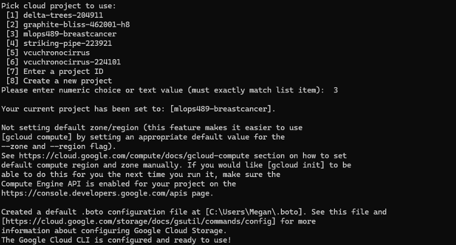
    - Create an artifact repository. Example command: `gcloud artifacts repositories create mlops489breastcancer --repository-format=docker --location=us-east1`. 
    - Now install the [Google Build](https://cloud.google.com/build/docs/set-up) in the github repository we created. Follow the instructions in the google build documentation. Note: As you connect the repository you will need to select the appropriate repository otherwise it will apply to all of them.  
    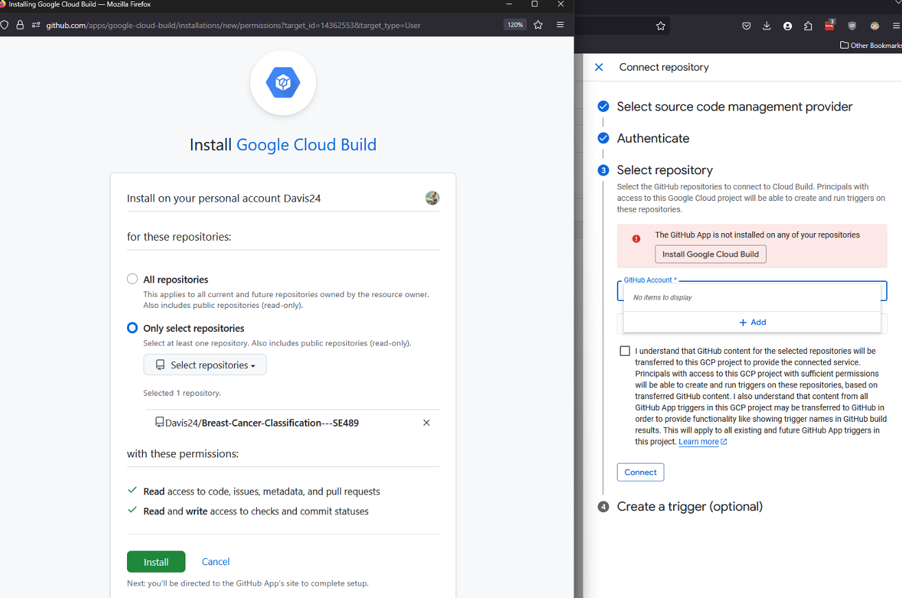
    - Once your fully connected you should see a success message as such, this means we're all setup to start building the trigger.
    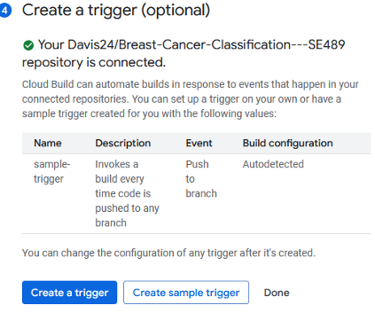
    - For the trigger we want this to be used to create and build a docker image from the information within our repository. We already have a set of docker images in `\docker`. However for this particular part we only want to use one docker image. Since we already built the model in the prior steps we decided to use `docker\run.dockerfile`. As part of this process we added the file to our main directory as that's where we set GCP to look at and renamed the file to `Dockerfile`, which is the more common naming convention. In addition, we need to create a `cloudbuild.yaml` file. This file we setup the ability for the image to be build and then deployed. Refer to our `cloudbuild.yaml` file for the commands. 
    - Once these items are setup you will need to buildout each part of the trigger, and then execute it to run. We've included screenshots of this process below.
      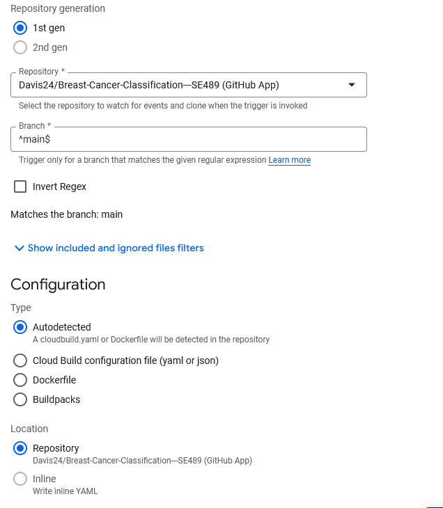
      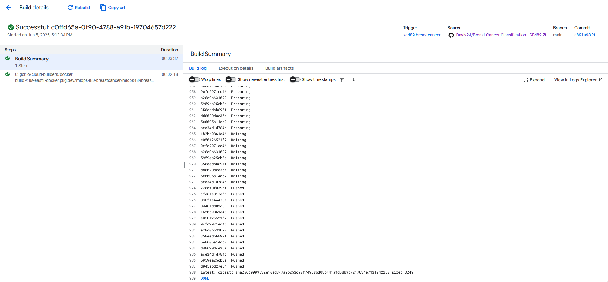
      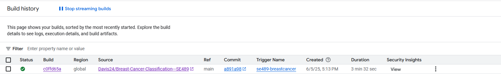
      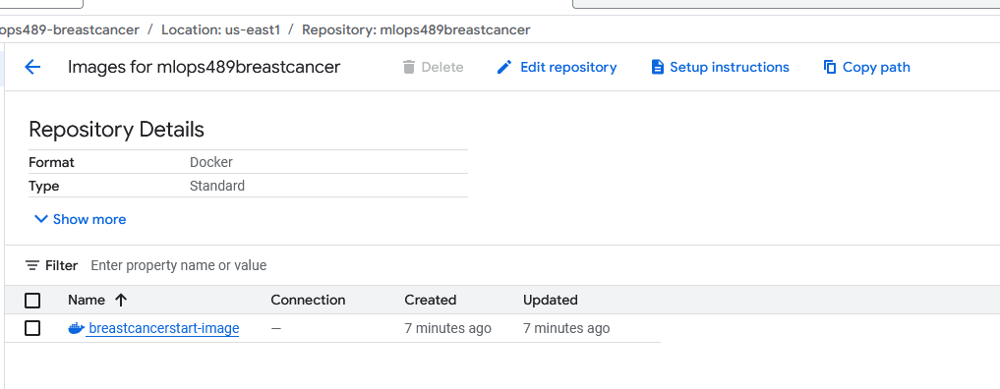
    
- **3.2 Custom Training Job on GCP**
  - For creating a custom training job we decided to work through using Vertex AI to get us started. Below we will detail the high-level steps for this process, but highly recommend review GCP literature.
    - Navigate to the Vertex AI part of GCP. Under Model Development >> Training we will be creating a new training model. 
    - (1) Training Model: Select No Managed Dataset, and custom training
    - (2) Model Details: Train New Model. Give it a name.
    - (3) Training Container: Select Custom Container, and then browse and found you container you built as part of the previous step.
        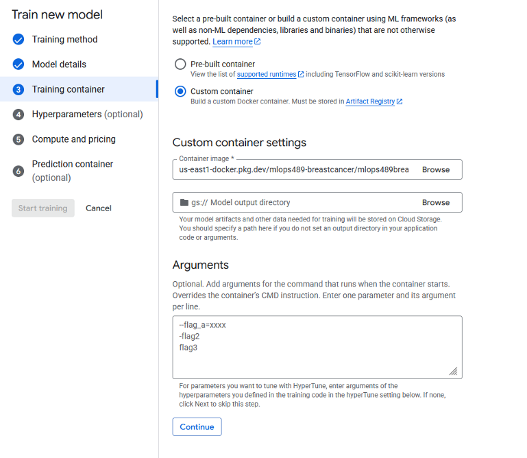
    - (4) Hyperparamters: we did not adjust.
    - (5) Compute and Price: we selected the cheapest compute and pricing option that was available. 
    - (6) Prediciton Container: optional.
  - After you have created the model, it will begin to run. It may take a few minutes for this process to complete you can review it in the logs if you are concerned it's not working or it runs into an issue.
    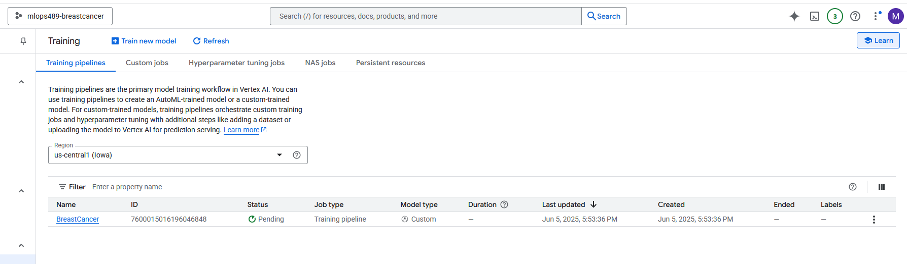
    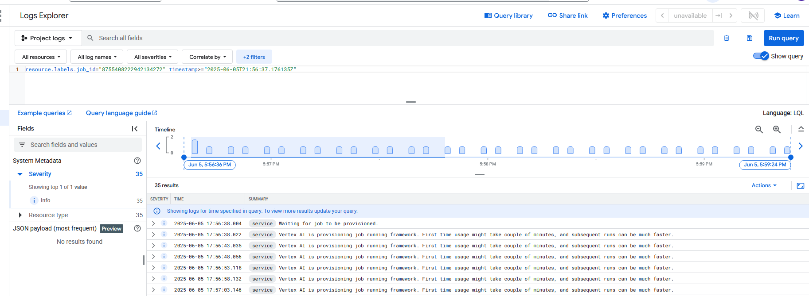
    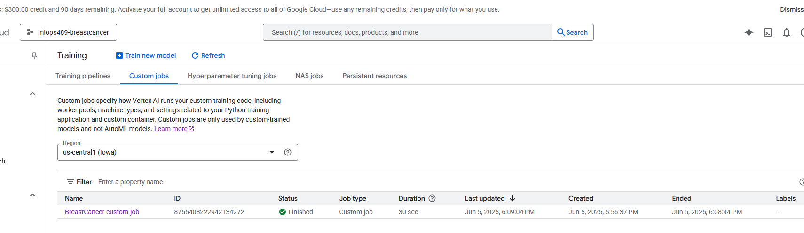
  - Lastly, to create a data storage bucket is very straight forward. Search for data buckets in the google cloud console. 
  - Create a new bucket, name it whatever you want. 
    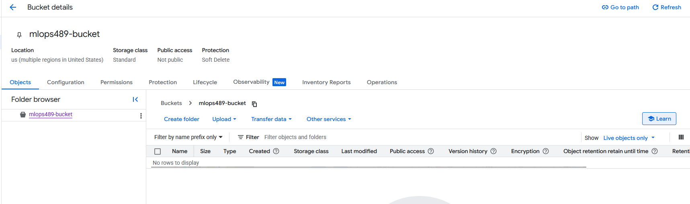
  - Once it is created you can click into it and parse through the various tabs. This is where your data will be output / stored. 
  
- [ ] **3.3 Deploying API with FastAPI & GCP Cloud Functions**
  - [ ] FastAPI app for model predictions
  - [ ] Deployment steps and API testing instructions
- [ ] **3.4 Dockerize & Deploy Model with GCP Cloud Run**
  - [ ] Containerization and deployment steps
  - [ ] Testing and result documentation
- [ ] **3.5 Interactive UI Deployment**
  - [ ] Streamlit or Gradio app for model demonstration
  - [ ] Deployment on Hugging Face platform
  - [ ] Integration of UI deployment into GitHub Actions workflow
  - [ ] Screenshots and usage examples

## 4. Documentation & Repository Updates
- [ ] **4.1 Comprehensive README**
  - [ ] Setup, usage, and documentation for all CI/CD, CML, and deployment steps
  - [ ] Screenshots and results of deployments
- [ ] **4.2 Resource Cleanup Reminder**
  - [ ] Checklist for removing GCP resources to avoid charges

---

> **Checklist:** Use this as a guide for documenting your Phase 3 deliverables. Focus on automation, deployment, and clear, reproducible instructions for all steps.
