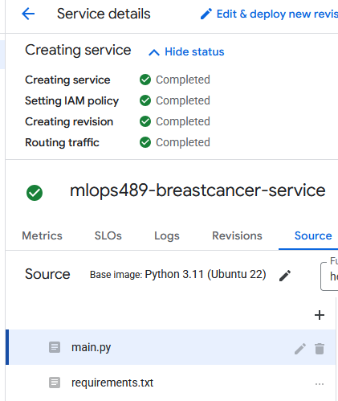
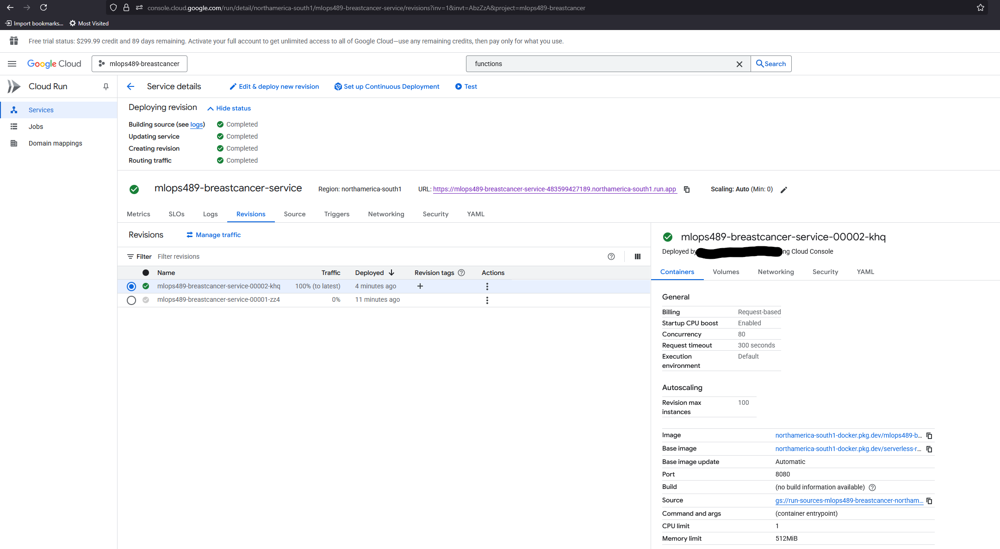
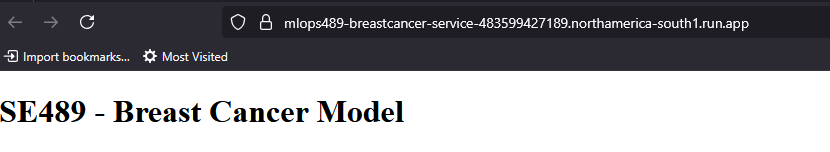
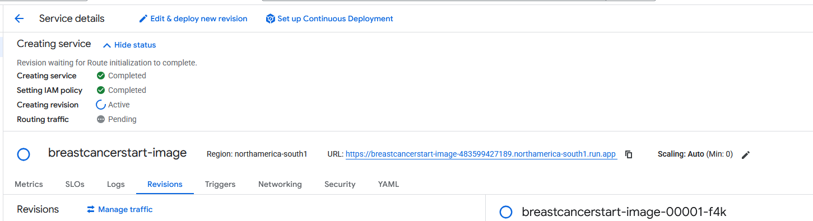

# PHASE 3: Continuous Machine Learning (CML) & Deployment

## 1. Continuous Integration & Testing
- [ ] **1.1 Unit Testing with pytest**
-For this section we focused on unit testing three aspects of our code, our dataset loading, our predicting capabilities, and training our model. Thus, the unit testing was tied to the files dataset.py, train.py, and predict.py with associated testing files being test_dataset.py, test_train.py, test_predict.py in line with the convention used in class for naming these files. Since calling the file to be loaded would be repeated process for these tests we made included the pytest.fixture decorator for this function so that the other functions could call the load function. The first test was done to make sure a fully populated two dimensional dataframe was loaded in, displaying the associated dimensions. Next we created tests around ensuring the dependent variable was in the list columns and to check if there were any missing values in the dataset. This is to ensure we have the target variable we are modelling and that we will catch issues related to building a model with NaN’s, and thus we can subsequently deal with that issue. Finally, since the classification response starts off as strings but gets converted to 1’s and 0’s, we check to make sure this conversion happened successfully so that a model can be built from the dependent variable. 
-For test_predict.py we created pytest.fixture decorator function around loading the data, loading the hydra associated yaml file, and creating and fitting the model. From here we created tests checking if the outputs from the training process matched our expectations of what should come out of the training process. Thus, we tested if our prediction vector’s length matched that of our y_test vector. We also tested to ensure accuracy was being computed properly and thus if it fell within proper bounds of 0 to 1. We also checked the shape and total of the confusion matrix to ensure we had modelled a classification process with a 0,1 response variable properly. We also tested if our feature importance was behaving properly by properly sorting the features by importance, if the amount of coefficients matched the amount of features from this analysis, and that all coefficients were non-zero values. We also made tests around loading the pkl file to ensure that it had the proper hyperparameter value set, in our case max_iterations, and that the model was indeed a logistic regression.
 -Finally, the file test_train.py pertained to unit testing the file train.py. The fixture functions are largely the same as test_predict.py. We performed some tests around preprocessing the data. We test if the training and test sizes are of the proper length. We also ensure the training and testing data hold the correct columns. We also check the variable type for the array that come out of scaling to ensure they are still arrays. To ensure we can properly train a model, we check if there are any NaN’s in the testing and training data for the independent and dependent variables. We also tested the conig values were correct and that the model predictions were of the proper length. We also ensured that the fitted model had coefficient terms and an intercept term, in line with our expectations for a logistic regression. 
These were the tests we performed to ensure the dataset, training process, and prediction capabilities of our classification were functioning in line with how expect them to perform and enables our model to perform as intended. 

- [ ] **1.2 GitHub Actions Workflows**
  - We have created actions in the github project and also added the workflow yaml files to the project directiory, which can be found in `./github/workflows`. There are a total of three actions and yaml files. We have the `ruff.yml` which contains the information for running ruff, `docker-image.yml` for docker, and `cml.yml` for model-training. As for the project actions, you where you can find `Ruff`, `model-training`, and `Docker Image Continuous integration`. We setup the `Ruff` workflow to run on each push.
  - **NOTE: It is expected that some of these checks will fail due to the fact we need a particular ordering in the code for it to work. However, we fixed any errors that were needed.**
  
- [ ] **1.3 Pre-commit Hooks**
  - As for the pre-commit hooks we decided to focus on adding `mypy` and `ruff`. For adding pre-commit hooks you need to first install the `pre-commit` framework using `pip install pre-commit`. From then on we can create a yaml file to store our precommit requirements. We created `.pre-commit-config.yaml`, in here we put in the logic for checks that run with each step. We want to note that the reason we have SKIPPED is because in this commit we were not adding any NEW files that would require ruff or mypy formatting.
   

  

## 2. Continuous Docker Building & CML
- **2.1 Docker Image Automation**
  - Docker builds have been automated. build images are pushed to dockerhub successfully. You can see an example here:

  

  - Docker builds are pushed to dockerhub automatically through a github action managed in a workflow file. The work flow files can be found in .github/workflows/docker-image.yml. In section 3.1 we will dive into GCP. The steps to make this build are simply to perform git push when you have this repository directed to a remote repository. This action is engaged with every push.
- **2.2 Continuous Machine Learning (CML)**
  - We have CML integreations on Pull requests in our remote repository. When ever a pull request is made and changes are pushed to the main branch, comments should appear in line with pull request comments. We did not enable any other checks as we want to be able to push anyways in our case. Please see below for a successful test of this functionality. (this was using a seperate repository for access issues, but has been installed in the current team repo as well)

 

  - In order to set this functionality up we had to create a cml.yml file in .github/workflows/cml.yml. There the functionality that is called on when a push to the main branch is executed in the remote repository is stored. Additonally, plots and metrics need to be generated by our train function in order for the execution of this action to work. That code was entered in our train.py function.

## 3. Deployment on Google Cloud Platform (GCP)
- **3.1 GCP Artifact Registry**
  - There is a bit of setup in order to create an artifact witin GCP. Below we walk through the steps at a high-level but recommend that you review Google's documentation as it may change. 
    - Create a Google Cloud Account, you can register for free.
    - Create the project using the WEBGUI, follow the instructions [here](https://cloud.google.com/resource-manager/docs/creating-managing-projects). Select a name that seems most appropriate we went with `mlops489-breastcancer`.
    - Install the Google Cloud CLI commands and follow the instructions [here](https://cloud.google.com/sdk/docs/install-sdk) on connecting you terminal to your account.
    - If your CLI command connection was successful you will be able to select what project you wish to work on. See img below.
     
    - Create an artifact repository. Example command: `gcloud artifacts repositories create mlops489breastcancer --repository-format=docker --location=us-east1`. 
    - Now install the [Google Build](https://cloud.google.com/build/docs/set-up) in the github repository we created. Follow the instructions in the google build documentation. Note: As you connect the repository you will need to select the appropriate repository otherwise it will apply to all of them.  
    
    - Once your fully connected you should see a success message as such, this means we're all setup to start building the trigger.
    
    - For the trigger we want this to be used to create and build a docker image from the information within our repository. We already have a set of docker images in `\docker`. However for this particular part we only want to use one docker image. Since we already built the model in the prior steps we decided to use `docker\run.dockerfile`. As part of this process we added the file to our main directory as that's where we set GCP to look at and renamed the file to `Dockerfile`, which is the more common naming convention. In addition, we need to create a `cloudbuild.yaml` file. This file we setup the ability for the image to be build and then deployed. Refer to our `cloudbuild.yaml` file for the commands. 
    - Once these items are setup you will need to buildout each part of the trigger, and then execute it to run. We've included screenshots of this process below.
      
      
      
      
    
- **3.2 Custom Training Job on GCP**
  - For creating a custom training job we decided to work through using Vertex AI to get us started. Below we will detail the high-level steps for this process, but highly recommend review GCP literature.
    - Navigate to the Vertex AI part of GCP. Under Model Development >> Training we will be creating a new training model. 
    - (1) Training Model: Select No Managed Dataset, and custom training
    - (2) Model Details: Train New Model. Give it a name.
    - (3) Training Container: Select Custom Container, and then browse and found you container you built as part of the previous step.
        
    - (4) Hyperparamters: we did not adjust.
    - (5) Compute and Price: we selected the cheapest compute and pricing option that was available. 
    - (6) Prediciton Container: optional.
  - After you have created the model, it will begin to run. It may take a few minutes for this process to complete you can review it in the logs if you are concerned it's not working or it runs into an issue.
    
    
    
  - Lastly, to create a data storage bucket is very straight forward. Search for data buckets in the google cloud console. 
  - Create a new bucket, name it whatever you want. 
    
  - Once it is created you can click into it and parse through the various tabs. This is where your data will be output / stored. 
  
- [ ] **3.3 Deploying API with FastAPI & GCP Cloud Functions**
  Note for clarification GCP Cloud Functions was renamed in 2024 to Cloud Run Functions. In addition because of this both the Cloud Run and Cloud Function exist in the same space, so they're providing the same service. The only difference is the utilization of a function script versus a docker img.

  - For FASTAPI we will be setting up an API to allow us to pass data into the API and it return a classification. We will not be going into what APIs are or how they work (outside of their implementation for this project). We recommend you review some standard API literature if you are unsure how it works.
    - First we need to install FastAPI  `pip install fastapi uvicorn`. 
    - Next we need to create a directory to store the FastAPI app, in our project we chose `app`. But it can be named anything. 
    - Inside `app` we made a new file called `app.py`. In this file we imported any required packages, as well as setting up FastAPI using the line `app = FastAPI()`.
    - In this file we need to define the routes we want `/` is the home page. For this we put a simple message. As for `/predict`, we ingest data from the user that then is fed into the model to predict. Once we generate the predictions we return it. 
    - As part of this we will also need to run a docker image that will function as the webserver for this. This handles the request part of the `post` and `get` sections. In our project we created a `app/Dockerfile`. 
    - When you run the docker contain you will need to specify the ports to run on `docker run -d -p 8000:8000 <dockerimgname>`
    - Once the docker image is running we can test by passing a post request with values. An example might be `json" -H "Content-Type: application/json" -d '{"features": [17.99,10.38,122.8,1001,0.1184,0.2776,0.3001,0.1471,0.2419,0.07871,1.095,0.9053,8.589,153.4,0.006399,0.04904,0.05373,0.01587,0.03003,0.006193,25.38,17.33,184.6,2019,0.1622,0.6656,0.7119,0.2654,0.4601,0.1189]}'`

  - Cloud Functions is the second part of the API deployment setup. It will require some setup steps within the cloud to work. 
    - Cloud function requires the enablement of a specific API. If it is not enabled GCP will request you enable it. Once enabled you can continue on into creating a function.
    - In the Create Services section there will be multiple options we want to select Function - Use an Inline editor to create a function. You will need to provide the Service Name, Region and Endpoint URL, and Runtime. We created our own name `mlops489-breastcancer-service`, selected a nearby region US-Mexico Python 3.11. You can add a trigger if needed. The rest of the options depend on your project and requirements. We didn't choose anything unusual here. 
    - The creating make take a few moments but when complete, you should see that it successfully ran.
      
    - Now you can modify the `main.py` and `requirements.py`, you can check our repo for those if you wish to copy. 
    - Once you update these files you can save and redeploy. It will take a few moments to run (depending on all the changes made). To validate everything is work there are multiple ways to check. You can check through the `Logs` tab, navigate through the URL, or even as it becomes more suffisticated use an API tester like Postman for these steps. For us we just manually valiated that the URL worked. 
     
      
    - We could have explored this more, however as we noted above GCP Cloud Function and Cloud Run are part of the same service now. 
- [ ] **3.4 Dockerize & Deploy Model with GCP Cloud Run**
  - For dockerizing and deploying a model with GCP cloud run a lot of the steps will follow what we described in 3.1 GCP Artifact Registry, the reason for this is we have already setup and deployed our dockerized model as part of those steps. If at any point we needed to augment the dockerfile we can simply rebuild and the already existing pipeline will create it. However, we can go ahead and create a cloud run that ties to that docker instance. We decided to use the GUI first as it was easier to navigate compared to the CLI commands.
    1. First, in the Cloud GCP GUI navigate to Cloud Run. In the top left click Deploy container.
    2. Now there are a couple of different options. If you have a static image you can define it to setup with an existing image in the artifact registery. Github, if you think you'll be rebuilding frequently. 
    3. Depending on which you choose you will need to connect to github, or you will need to select your docker img. 
    4. Select what you wish to setup for either of these. Things like: CPU, Hosting Data Center, and IAM policy will be dependant upon your project. For us we chose CPU only when needed, IAM any access, and Mexico hosting center.
    5. Wait for it to be built. This may take a few minutes.
      
    6. Once the image is successfully built you can navigate to the provided URL.
    7. KEEP IN MIND! Depending on your security settings anyone can access this URL, do not store sensitive information without proper security on an external facing URL. In addition if you're exposing an API to the public we recommend you look into adding rate limiting to prevent abuse. We've included additional resources on this below. 
      - https://datadome.co/bot-management-protection/what-is-api-rate-limiting/
      - https://medium.com/@bijit211987/everything-you-need-to-know-about-rate-limiting-for-apis-f236d2adcfff
- [ ] **3.5 Interactive UI Deployment**
-We created a streamlit app and deployed it to hugging face. This app is meant to enable the user to enter in their own information regarding the top 5 features and receive a response. The output is a 0 or 1 and maps to Benign or Malignant. The probability associated with the prediction is also provided. For all the other factor we set a toggle where those will be replace with either the mean or the median value of each feature. This was because our model was very large and did not want to make our interface too overwhelming with too many features. Thus, we only make the 5 most important features toggleable.  
-In order to connect to git hub actions we had to make three secrets on our github action to link to our huggingface repository. These were:
HF_TOKEN
HF_USERNAME: aberkley123
HF_SPACE_NAME: StreamlitProduction
-Additinoally, we had to update our deploy.yaml to accommodate deploying on huggingface. We also needed to update our gitignore file as this was causing conflicts with our deploy.yaml file. Finally, due to conflict with huggingface we needed to update our requirements file to align with what huggingface was able to deploy. 

- Link to huggingface deployment: https://huggingface.co/spaces/aberkley123/StreamlitProduction

